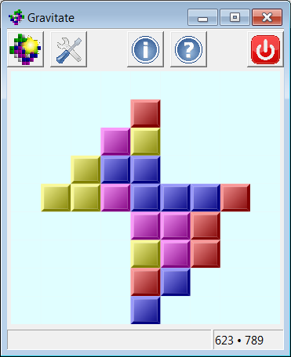

# Gravitate

A SameGame/TileFall-like game written in C++/wxWidgets

**A precompiled binary for 64-bit Windows is in Gravitate.zip.**

## Build

You will need a C++ compiler, the wxWidgets library, and the
[scons](https://scons.org/) build tool.

On Windows you'll also need:
- to obtain and build the
[wx-config-win](https://github.com/eranif/codelite/tree/master/sdk/wxconfig)
tool;
- to edit the `SConstruct` file to change the `prefix` to the path to where
  your wxWidgets source code is and the `wxconfig` to the path where you've
  installed `wx-config.exe`;
- to optionally install the [rcedit](https://github.com/electron/rcedit)
  tool if you want `Gravitate.exe` to have an icon in Windows Explorer.

On Unix and Windows just `cd` to Gravitate's source folder and run `scons`.

Then, move the `Gravitate` or `Gravitate.exe` executable to somewhere
convenient.

## License

GPL-3.0.

## Other Versions

For versions in D/GtkD, Nim/NiGui, Java/AWT/Swing, Python/Tkinter,
Python/wxPython, and JavaScript see
[www.qtrac.eu/gravitate.html](http://www.qtrac.eu/gravitate.html).
